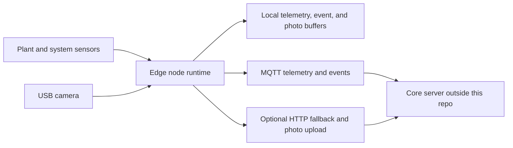

# Edge Architecture

Senior Pomidor Edge Node is the Raspberry Pi layer of the project. It reads local sensors, stores observations locally, captures optional photos, and publishes contract-shaped payloads to the Core server.

## Runtime Boundaries

- In scope: sensor reads, derived VPD metrics, local buffering, lifecycle events, photo capture, payload formatting, MQTT publish, optional HTTP fallback, and Raspberry Pi setup automation.
- Out of scope: Core server, database, dashboards, AI/VLM processing, runtime state estimation, public datasets, actuation, and autonomous control.

## Failure Model

Sensor and health probes are isolated. A failed probe reports an error field and should not stop the main telemetry loop. Local storage happens before network delivery so observations can survive temporary outages.
